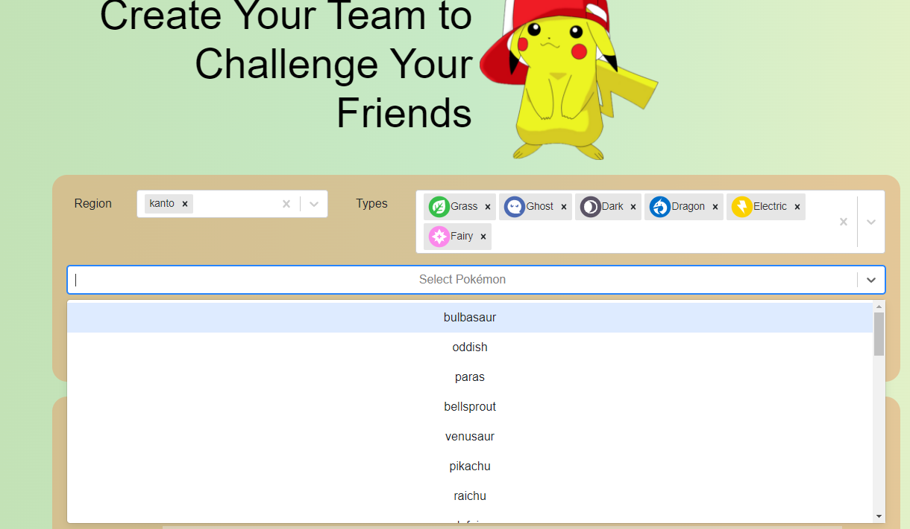
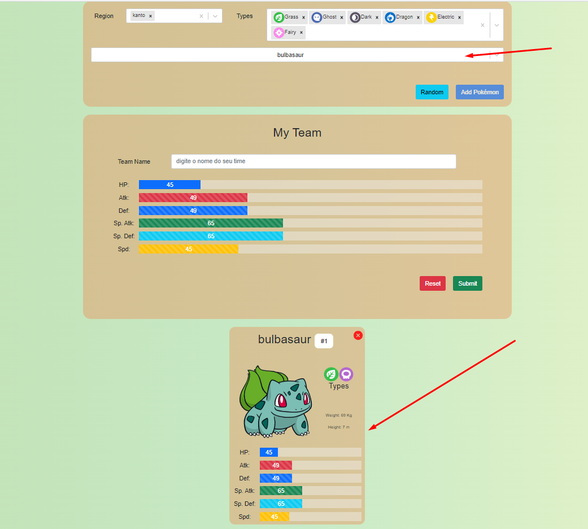
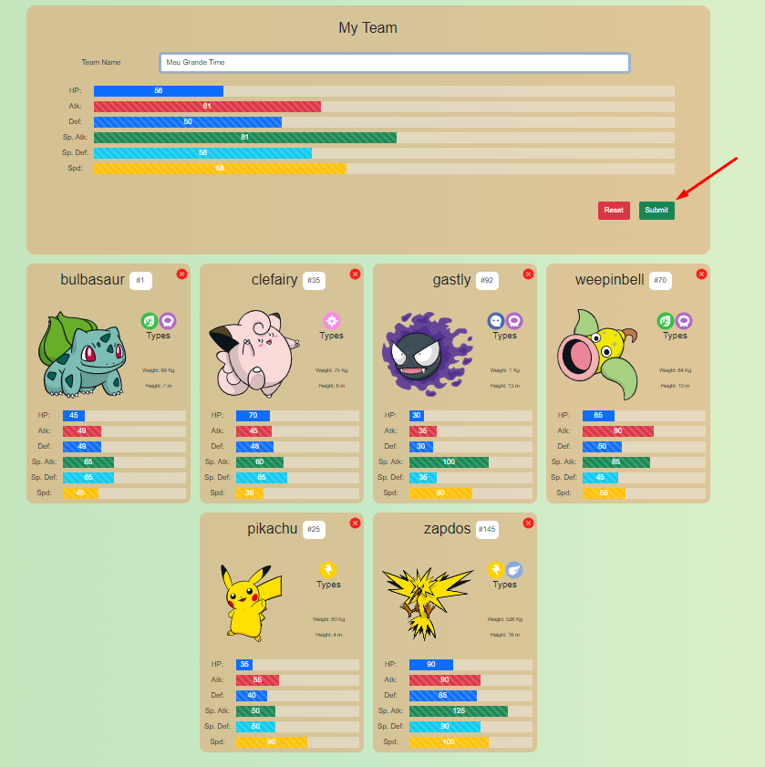
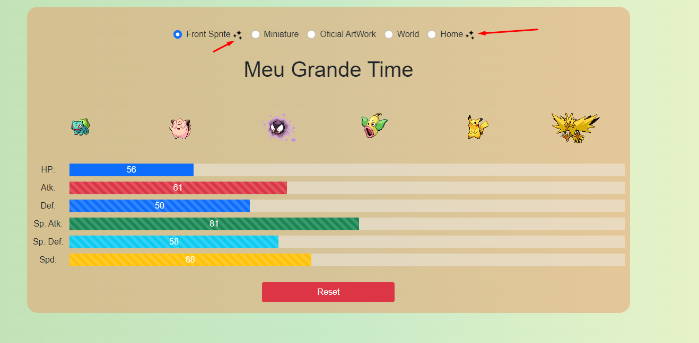
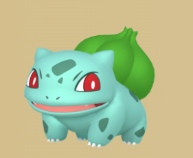
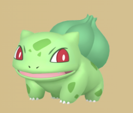
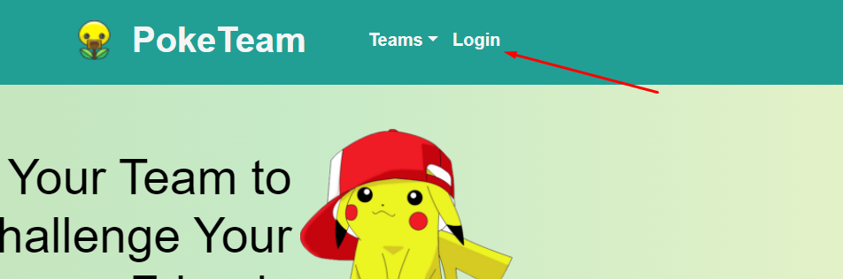
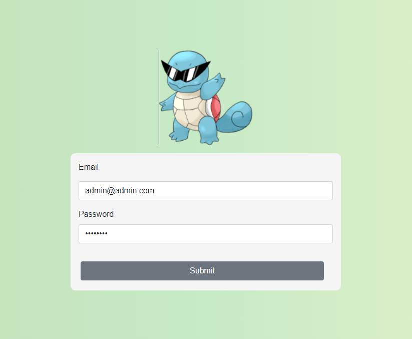
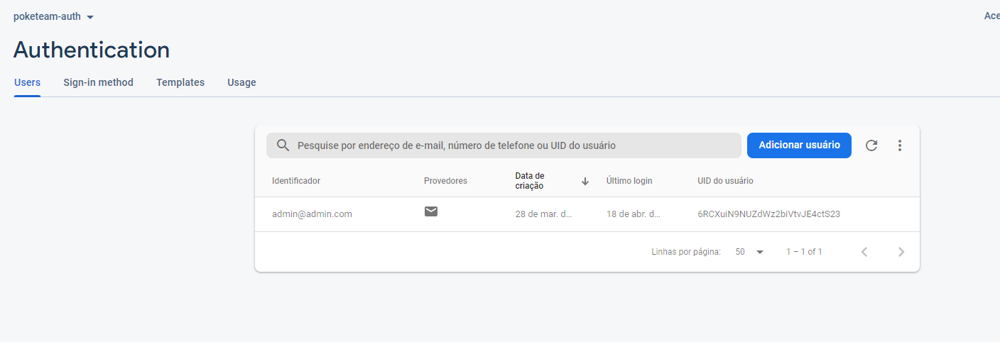
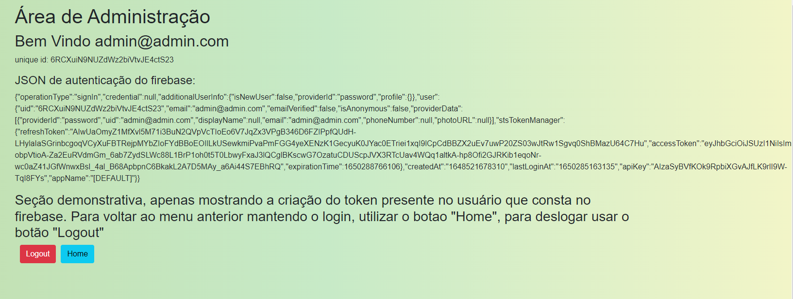

# poke_team
ReactJs project that allows you choose and shuffle pokemons based on generation/homeland and type. It consumes pokemon API to get all pokemon information.

# Some Tips
It's necessary to select the regions and types of pokémons, regardless of the order of selection between these two parameters. When there is at least 1 region and 1 type selected, the pokemons that matches in these filters will appear.
Be aware, some region may does not have a specific pokémon type, for example, the first generation, Kanto, does not have a Dark type.

# How To Start
You can start this project running yarn start or npm run star.

Now you can choose the regions and types you will to list the pokémons.

It's possible to choose the pokémon in the list or shuffle it clicking in the random button. The random button you choose between the pokémons in the list, these pokemóns respect the region and type list especified before.

The Selected Pokémon or the shuffled one will be added below. You can do it untill you reach 6 pokémons (maximum quantity allowed in the classic games to be in your teams)

Each pokemon is represented by a card that has the pokemon type information, weight, height and stats attributes. You can remove a pokemon from your list by clicking the X button at the top right of the card.
It is also possible to click on the “Random” button, that will choose a random pokémon with the selected type and region filters.
The maximum size of a pokemon team is 6 pokemons.

Within the desireds pokemons, you must name your team and click submit to get feedback from your team.
after submitting the team, you will get the average attributes of each pokemon in the team and several possibilities of sprites (pictures of pokemons) for you to take a print screen and share with your friends.

SPRITE MODELS within the SHINY symbol  allow you to click on one or more pokemons to switch between the standard sprite and the shiny sprite. Below we can see the bulbasaur on the left with a standard sprite and on the right as shiny.

 

The login information is already set as “initialValues” of the useState hook. Just need to log in.

Here we will only have information about the information of the user who is registered in firebase.

Ao clicar em Logout, ocorrerá o logout e voltará para a tela inicial. Ao clicar em Home, voltará para a pagina inicial porém logado. Na tela inicial o botão de login irá virar um dropdown com as informações da conta.

When you click in Logout, logout will occur and you redirect you to the home screen. When you click on Home, you will return to the home page but logged in. On the home screen the login button will turn into a dropdown with the account information.

